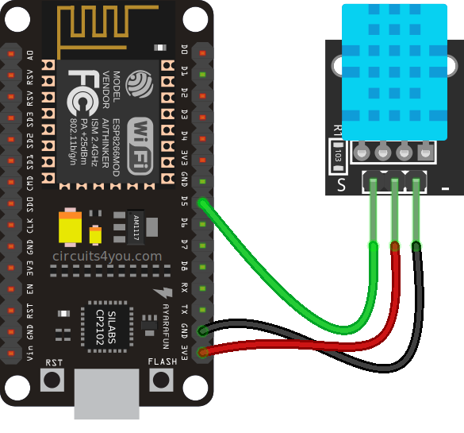
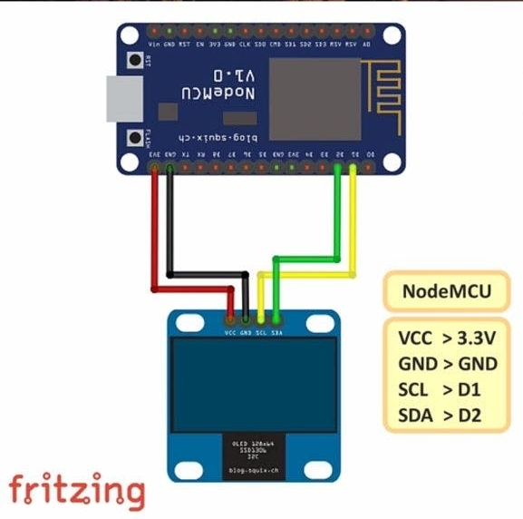
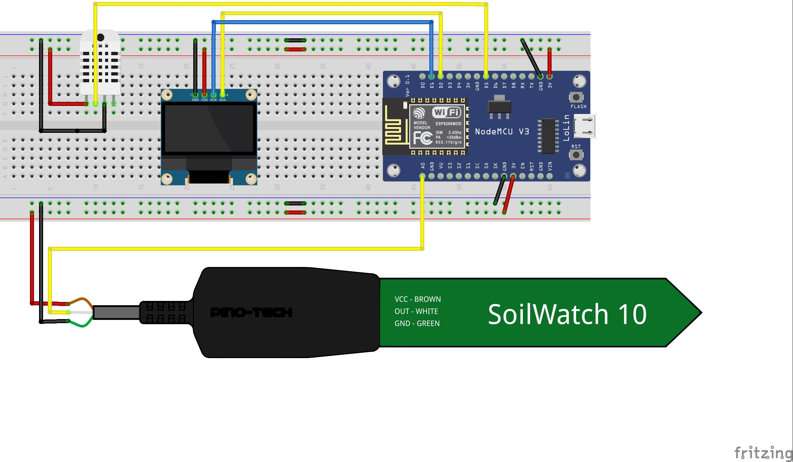

# NodeMCU_weather_monitor
This repository is used for building weather monitor with NodeMCU ESP8266 module.

## Interfacing of DHT-22 with NodeMCU

## Interfacing of OLED with NodeMCU

## Complete schematic of Weather Monitor
